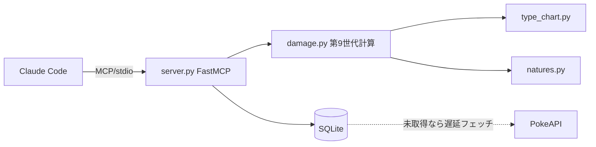

# pokemon-mcp

正確なポケモンデータと**第9世代ダメージ計算**を提供する MCP サーバー。
Claude Code が Web 検索の代わりにこれを叩くことで、**コンテキスト消費を抑えつつ正確な数値**を得る。

## なぜ RAG ではなく構造化 + 計算ツールか

ポケモンのデータは大半が構造化(種族値・技威力・タイプ相性)で、**数値の正確さが命**。
embedding 検索は意味的に近いものを返すため数値を取り違えるリスクがある。よって本プロジェクトは
embedding を使わず、**exact lookup(SQLite/PokeAPI)+ 計算エンジン**で構成する。

## アーキテクチャ



- `damage.py` — ダメージ式・実数値・多段(トリプルアクセル威力20/40/60)・乱数16通り・KO%(畳み込み)。命中(光の粉等)は別軸。
- `type_chart.py` — 第6世代以降のタイプ相性。
- `natures.py` — 性格補正(日本語名エイリアス対応)。
- `data.py` — SQLite キャッシュ + PokeAPI 遅延フェッチ。
- `server.py` — FastMCP でツール公開。

## 公開ツール(MVP)

| ツール | 役割 |
|---|---|
| `get_pokemon` | 種族値・タイプ・特性 |
| `get_move` | 威力・命中・タイプ・分類・多段 |
| `type_effectiveness` | 相性倍率 |
| `calc_stat` | 実数値 |
| `calc_damage` | 撃ごと/累計のダメージ・KO%(多段・テラスSTAB・道具・天候対応) |
| `calc_accuracy` | 命中率・多段の命中回数分布(光の粉/ふくがん/ランク補正) |

ポケモン名・技名は英語slug/日本語名どちらも可(日本語名の解決には `build_db.py --aliases` で索引構築が必要)。
道具(いのちのたま/こだわり系/たつじんのおび/タイプ強化アイテム等)・天候(晴れ/雨/砂/雪)に対応。

## セットアップ

```bash
uv sync
uv run pytest            # ダメージエンジンの検証(今日の手計算を再現)
uv run pokemon-mcp       # MCPサーバー(stdio)を起動
# 全件オフラインDBを作る場合(任意・数分):
uv run python scripts/build_db.py
```

## Claude Code への登録

```bash
claude mcp add pokemon -- uv --directory /Users/sui/Programing/nymphaea.dev/pokemon-mcp run pokemon-mcp
```

## 仕様の正確さ

`tests/test_damage.py` が「陽気マスカーニャ(変幻自在)トリプルアクセル vs 無振りガブリアス Lv50」の
手計算(各撃 64-84 / 132-156 / 196-232、2撃目で確定気絶)を再現することでエンジンを検証している。
