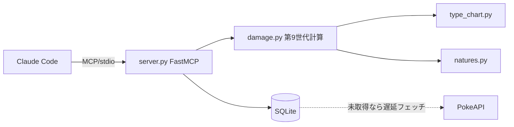

# pokemon-mcp

正確なポケモンデータと**第9世代ダメージ計算**を提供する MCP サーバー。
Claude Code が Web 検索の代わりにこれを叩くことで、**コンテキスト消費を抑えつつ正確な数値**を得る。

## なぜ RAG ではなく構造化 + 計算ツールか

ポケモンのデータは大半が構造化(種族値・技威力・タイプ相性)で、**数値の正確さが命**。
embedding 検索は意味的に近いものを返すため数値を取り違えるリスクがある。よって本プロジェクトは
embedding を使わず、**exact lookup(SQLite/PokeAPI)+ 計算エンジン**で構成する。

## アーキテクチャ



- `damage.py` — ダメージ式・実数値・多段(トリプルアクセル威力20/40/60)・乱数16通り・KO%(畳み込み)。命中(光の粉等)は別軸。
- `type_chart.py` — 第6世代以降のタイプ相性。
- `natures.py` — 性格補正(日本語名エイリアス対応)。
- `data.py` — SQLite キャッシュ + PokeAPI 遅延フェッチ。
- `server.py` — FastMCP でツール公開。

## 公開ツール(MVP)

| ツール | 役割 |
|---|---|
| `get_pokemon` | 種族値・タイプ・特性 |
| `get_move` | 威力・命中・タイプ・分類・多段 |
| `type_effectiveness` | 相性倍率 |
| `calc_stat` | 実数値 |
| `calc_damage` | 撃ごと/累計のダメージ・KO%(多段・テラスSTAB・道具・天候対応) |
| `calc_accuracy` | 命中率・多段の命中回数分布(光の粉/ふくがん/ランク補正) |

ポケモン名・技名は英語slug/日本語名どちらも可(日本語名の解決には `build_db.py --aliases` で索引構築が必要)。
道具(いのちのたま/こだわり系/たつじんのおび/タイプ強化アイテム等)・天候(晴れ/雨/砂/雪)に対応。

## セットアップ

```bash
uv sync
uv run pytest            # ダメージエンジンの検証(今日の手計算を再現)
uv run pokemon-mcp       # MCPサーバー(stdio)を起動
# 全件オフラインDBを作る場合(任意・数分):
uv run python scripts/build_db.py
```

## Claude Code への登録

```bash
# /path/to/pokemon-mcp は clone した実際のパスに置き換える
claude mcp add --scope user pokemon -- uv --directory /path/to/pokemon-mcp run pokemon-mcp
```

## 使い方

### Claude Code から自然言語で

登録後はそのまま日本語で聞けば、Claude が裏でツールを呼ぶ(Web検索しないのでコンテキストを食わない):

- 「陽気マスカーニャの変幻自在トリプルアクセル、無振りガブは耐える?」
- 「トリプルアクセルが光の粉持ちに3発当たる確率は?」
- 「いのちのたま+晴れのリザードン かえんほうしゃ、フシギバナへのダメージは?」

### ツール別の例

**`calc_damage`** — 対面ダメージ(撃ごと/累計のレンジ・KO%):

```jsonc
// 入力: 陽気マスカーニャ(変幻自在) A252 トリプルアクセル vs 無振りガブ
{ "attacker": "meowscarada", "defender": "garchomp", "move": "triple-axel",
  "attacker_offense_ev": 252, "attacker_nature": "jolly", "protean": true }

// 出力(抜粋)
{ "per_hit": [ {"hit":1,"min":64,"max":84}, {"hit":2,"min":132,"max":156}, {"hit":3,"min":196,"max":232} ],
  "cumulative": [ {"after_hit":2,"ko_chance":1.0} ],   // 2撃目で確定KO
  "defender_hp": 183, "type_eff": 4.0, "stab": 1.5 }
```

道具・天候・テラスの例:

```jsonc
{ "attacker":"charizard", "defender":"venusaur", "move":"flamethrower",
  "attacker_offense_ev":252, "attacker_nature":"modest",
  "item":"life-orb", "weather":"sun" }            // 晴れ×いのちのたま ≒ x1.95
```

**`calc_accuracy`** — 命中率・多段の命中回数分布:

```jsonc
{ "move":"triple-axel", "bright_powder": true }
// → per_check_hit_chance 0.81, all_hits_chance 0.531441,
//    hit_count_distribution { "0":0.19, "1":0.1539, "2":0.124659, "3":0.531441 }
```

**`calc_stat`** — 実数値:

```jsonc
{ "base":110, "level":50, "ev":252, "nature":"jolly", "stat":"atk" }   // → 162
```

**`type_effectiveness`** — 相性倍率:

```jsonc
{ "attacking_type":"ice", "defending_types":["ground","dragon"] }      // → 4.0(こうかばつぐん)
```

**`get_pokemon` / `get_move`** — 素のデータ:

```text
get_pokemon("garchomp")   → base_stats / types / abilities
get_move("triple-axel")   → power 20, accuracy 90, min_hits/max_hits 3, damage_class physical
```

### `calc_damage` のパラメータ早見

| 引数 | 既定 | 説明 |
|---|---|---|
| `attacker` / `defender` / `move` | (必須) | 名前(英語slug または日本語名) |
| `level` | 50 | レベル(1〜100) |
| `attacker_offense_ev` / `attacker_iv` / `attacker_nature` | 0 / 31 / hardy | 攻撃側(物理=A、特殊=Cは技分類から自動) |
| `defender_hp_ev` / `defender_defense_ev` / `defender_iv` / `defender_nature` | 0 / 0 / 31 / hardy | 防御側 |
| `protean` | false | 変幻自在/リベロ(常にSTAB 1.5) |
| `tera_type` | null | テラスタイプ(元タイプ一致なら2.0。攻撃側STABのみ) |
| `item` | null | `life-orb` / `choice-band` / `choice-specs` / `expert-belt` / `muscle-band` / `wise-glasses` / タイプ強化アイテム(`charcoal`等) |
| `weather` | null | `sun` / `rain` / `sand` / `snow`(日本語可) |
| `crit` | false | 急所 |
| `other` | 1.0 | その他の手動補正倍率 |

> 命中(光の粉等)は別軸。`calc_damage` は命中前提のダメージ・KO%を返す。命中率は `calc_accuracy` を使う。
> 可変多段(2-5発)の `ko_chance` はヒット数分布で重み付け、`ko_chance_all_hits` は最大ヒット前提(スキルリンク/こだわりサイコロ時)。

### 日本語名で引くには

技名は取得時に自動で日本語索引へ登録される。ポケモン名を含めて全件を日本語で引くには、一度だけ索引を構築する:

```bash
uv run python scripts/build_db.py --aliases   # 数分・一度きり
# → 以後「ガブリアス」「かえんほうしゃ」等でも引ける
```

## 仕様の正確さ

`tests/test_damage.py` が「陽気マスカーニャ(変幻自在)トリプルアクセル vs 無振りガブリアス Lv50」の
手計算(各撃 64-84 / 132-156 / 196-232、2撃目で確定気絶)を再現することでエンジンを検証している。
補正順序は第5世代以降の公式式(天候 → 急所 → 乱数 → タイプ一致 → 相性)に準拠。

## ライセンス

本プロジェクトの**ソースコード**は [MIT License](LICENSE) で公開している。

## 免責 (Disclaimer)

これは**非公式・非営利のファンプロジェクト**です。

- Pokémon およびポケモンのキャラクター名・技名は、任天堂 / 株式会社クリーチャーズ /
  株式会社ゲームフリーク(The Pokémon Company)の商標です。
- 本プロジェクトは任天堂・The Pokémon Company とは**一切関係なく、公認・後援も受けていません**。
- ゲームの画像・音声・アートワーク等の**著作物は一切含みません**。種族値・技・タイプ相性などの
  事実データは [PokéAPI](https://pokeapi.co/) から**実行時に取得**するのみで、本リポジトリには
  同梱・再配布していません(`data/pokedex.db` は `.gitignore` 済み)。
- MIT ライセンスは本プロジェクトのコードにのみ適用され、ポケモンのデータ・名称・商標には
  及びません。
- 非営利・個人利用を前提としています。商用利用は権利者の許諾が必要です。
